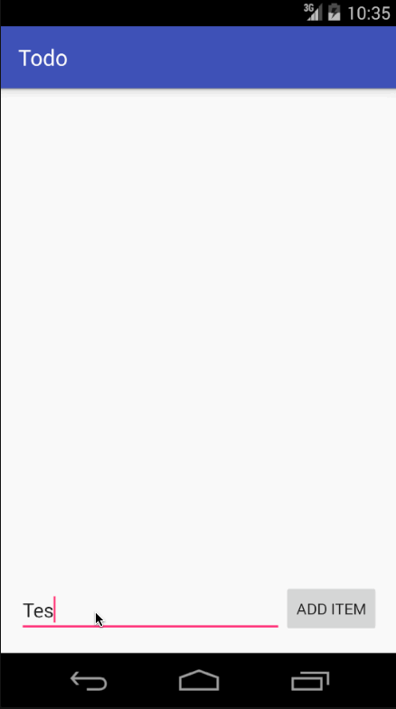

# AndroidToDoApp
Android ToDoList App

This is an Android Todo list application

Time spent: 16 hours spent in total

Completed user stories:

 * [x] Required: User can view a list of Todo items
 * [x] Required: User can successfully add and remove items from the todo list app
 * [x] Required: User can edit and save todo item
 * [x] Required: User can persist todo items and retrieve them properly on app restart
 * [x] Suggested: Updated the app to persist the todo items into SQLite instead of a text file
 * [x] Suggested: Improved style of the todo items in the list using a custom adapter
 * [x] Suggested: Added support for completion due dates for todo items (and display within listview item)
 * [x] Optional: Add support for selecting the priority of each todo item (and display in listview item)
 * [x] Optional: Tweak the style improving the UI / UX, play with colors, images or backgrounds
 
Additional functions:
* Added gesture support to allow sweep to delete.
* Added drag and drop to change the item position.
* Added status of the todo item. If the item is done, the todo text and date will be crossed out.

Walkthrough of all user stories:

GIF created with [LiceCap](http://www.cockos.com/licecap/).
